## 1. Develop a program to create histograms for all numerical features and analyze the distribution of each feature. Generate box plots for all numerical features and identify any outliers. Use California Housing dataset

```py
import matplotlib
# matplotlib.use("Agg")
%matplotlib inline

import matplotlib.pyplot as plt
import pandas as pd
import seaborn as sn
from sklearn.datasets import fetch_california_housing

housing = fetch_california_housing(as_frame=True)
# df = housing.frame
df = pd.read_csv("California_housing.csv")

df.hist(bins=30, figsize=(10, 15))
plt.suptitle("Histograms of california housing features", y=1.02)
# plt.savefig("histogram.png")
plt.show()
plt.close()

plt.figure(figsize=(12, 8))
sn.boxplot(data=df)
plt.title("Boxplot of california housing features")
plt.xlabel("Features")
plt.ylabel("Values")
# plt.savefig("boxplot.png")
plt.show()
plt.close()

```

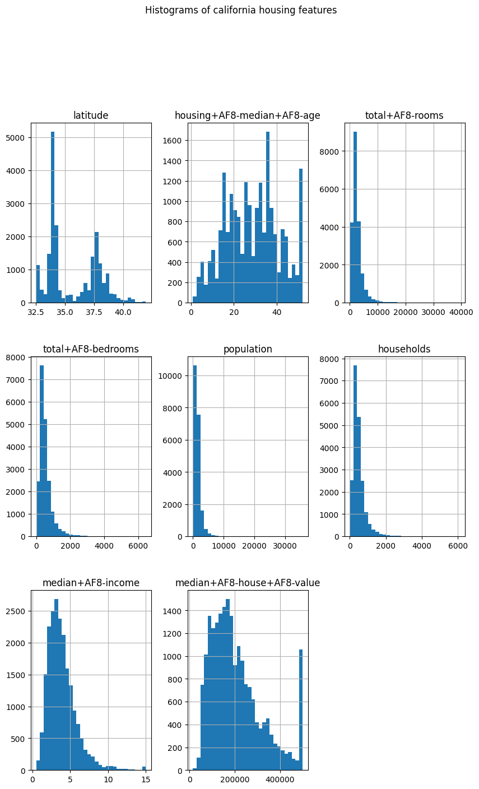

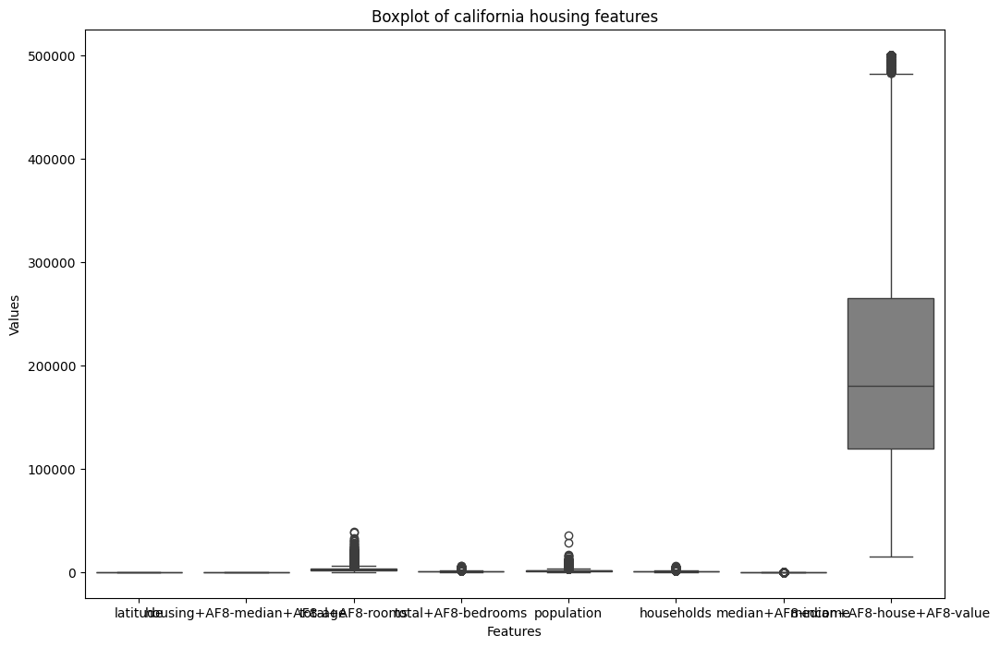

---

## 2. Develop a program to Compute the correlation matrix to understand the relationships between pairs of features. Visualize the correlation matrix using a heatmap to know which variables have strong positive/negative correlations. Create a pair plot to visualize pairwise relationships between features. Use California Housing dataset

```py
import matplotlib
# matplotlib.use("Agg")
%matplotlib inline

import matplotlib.pyplot as plt
import pandas as pd
import seaborn as sns
from sklearn.datasets import fetch_california_housing

housing = fetch_california_housing(as_frame=True)
df = housing.frame

# df = pd.read_csv("California_housing.csv")

df.head()

corr_matrix = df.corr()
# print("Correlation matrix: ", corr_matrix)

plt.figure(figsize=(12, 8))
sns.heatmap(corr_matrix, annot=True, cmap="coolwarm", fmt=".2f")
plt.title("Correlation matrix for california housing features")
plt.show()
plt.close()

#pair plot
g=sns.pairplot(df)
g.fig.suptitle("Pairplot of california", y=1.02)
plt.show()
plt.close()

```

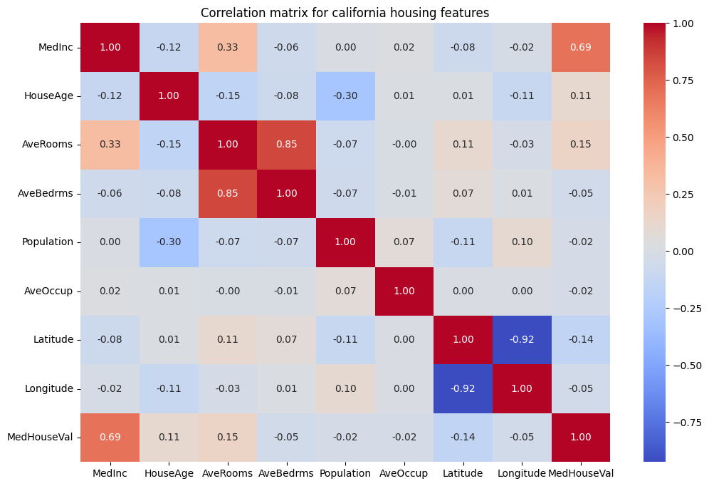

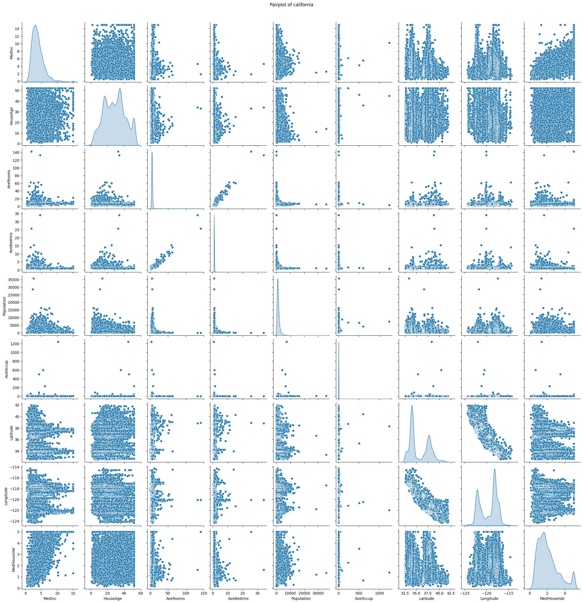

---

## 3. Develop a program to implement Principal Component Analysis (PCA) for reducing the dimensionality of the Iris dataset from 4 features to 2.

```py
import pandas as pd
import matplotlib.pyplot as plt
from sklearn.decomposition import PCA

# Load iris data from local CSV file (update the file path as needed)
df = pd.read_csv(r'iris.csv')

# If your CSV file doesn't have column headers, uncomment the following line and set the column names:
df.columns = ['sepal_length', 'sepal_width', 'petal_length', 'petal_width', 'species']

# Extract features and labels
X = df[['sepal_length', 'sepal_width', 'petal_length', 'petal_width']]
y = df['species']

# Create a PCA instance: reduce dimensions from 4 to 2
pca = PCA(n_components=3)
X_r = pca.fit_transform(X)

# Print the explained variance ratio to see the contribution of each component
print("Explained variance ratio:", pca.explained_variance_ratio_)

# Define colors for different species (adjust keys based on your CSV content)
colors = {'Iris-setosa': 'navy', 'Iris-versicolor': 'turquoise', 'Iris-virginica': 'darkorange'}

# Plot the PCA result
plt.figure(figsize=(8, 6))
for species in df['species'].unique():
    idx = df['species'] == species
    plt.scatter(X_r[idx, 0], X_r[idx, 1], c=colors.get(species),     label=species, edgecolor='k', s=50)

plt.xlabel('Principal Component 1')
plt.ylabel('Principal Component 2')
plt.title('PCA of IRIS Dataset')
plt.legend(loc='best')
# plt.grid(True)
plt.show()
# plt.savefig("pca2.jpeg")
plt.close()

```

`Explained variance ratio: [0.92461872 0.05306648 0.01710261]`

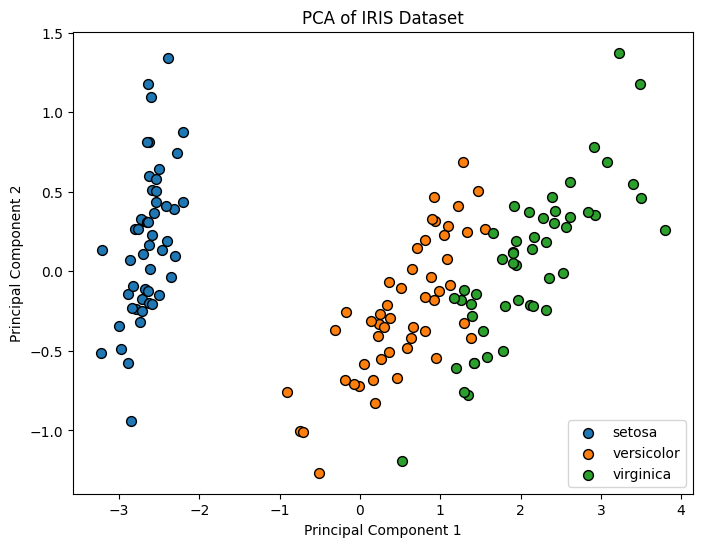

---

## 4. For a given set of training data examples stored in a .CSV file, implement and demonstrate the Find-S algorithm to output a description of the set of all hypotheses consistent with the training examples.

```py
import pandas as pd
import numpy as np

# Load dataset from CSV file
df = pd.read_csv("training_find_s.csv")

# Separate attributes and target labels
attributes = np.array(df)[:, :-1]
target = np.array(df)[:, -1]

# Find-S algorithm implementation
def find_s_algorithm(attributes, target):
    for i, val in enumerate(target):
        if val.lower() == "yes":
           specific_hypothesis = attributes[i].copy()
           break

# Generalize hypothesis based on positive examples
    for i, instance in enumerate(attributes):
        if target[i].lower() == "yes":
            for attr_index in range(len(specific_hypothesis)):
                if instance[attr_index] != specific_hypothesis[attr_index]:
                	specific_hypothesis[attr_index] = '?'
    return specific_hypothesis

# Get the final hypothesis
final_hypothesis = find_s_algorithm(attributes, target)
print("\nFinal Hypothesis:", final_hypothesis)

```

`Final Hypothesis: ['>=9' 'Yes' '?' 'Good' '?' '?']`

---

## 5. Develop a program to implement k-Nearest Neighbour algorithm to classify the randomly generated 100 values of x in the range of [0,1]. Perform the following based on dataset generated.
a. Label the first 50 points {x₁, ..., x₅₀} as follows: if (xi ≤ 0 5), then xi ∈ Class₁, else xi ∈ Class₁

b. Classify the remaining points, x₅₁, ..., x₁₀₀ using KNN. Perform this for k = 1, 2, 3, 4, 5, 20, 30

```py
#generate random 100 numbers between [0,1]
import random
# random.seed(000)
datapoints=[]
for i in range(100):
    n=random.random();
    n=round(n,3)
    datapoints.append(n)
# print(datapoints)

# Import the required modules
from sklearn.neighbors import KNeighborsClassifier
import numpy as np
import matplotlib.pyplot as plt


targetresult=[]
for data in datapoints:
    if(data<=0.5):
        targetresult.append(1)
    else:
        targetresult.append(2)
# print(targetresult)

# Split the datasets 
train_data=datapoints[:50]
train_result=targetresult[:50]
test_data=datapoints[50:]
test_result=targetresult[50:]
#print(train_data)
train_data=np.array(train_data).reshape(-1,1)
# print(train_data)
test_data=np.array(test_data).reshape(-1,1)
train_result=np.array(train_result)
test_result=np.array(test_result)

knn=KNeighborsClassifier(n_neighbors=1)
knn.fit(train_data,train_result)
print(knn.score(test_data,test_result))


#predicting score for k= 1 to k=30
score=[]
kValue=[]
for k in [1,2,3,4,5,20,30]:
    knn=KNeighborsClassifier(n_neighbors=k)
    knn.fit(train_data,train_result)
    score.append(knn.score(test_data,test_result))
    kValue.append(k)

plt.figure()
plt.plot(kValue,score)
plt.title('KNN Classfier accuracy - test data')
plt.xlabel('K-value')
plt.ylabel('accuracy')
plt.show()

#predicting score for k= 1 to k=30
# score=[]  
# kValue=[]
# for k in [1,2,3,4,5,20,30]:
#     knn=KNeighborsClassifier(n_neighbors=k)
#     knn.fit(train_data,train_result)
#     score.append(knn.score(train_data,train_result))
#     kValue.append(k)

# plt.figure()
# plt.plot(kValue,score)
# plt.title('KNN Classfier accuracy - train data')
# plt.xlabel('K-value')
# plt.ylabel('accuracy')
# plt.show()

```

`1.0`

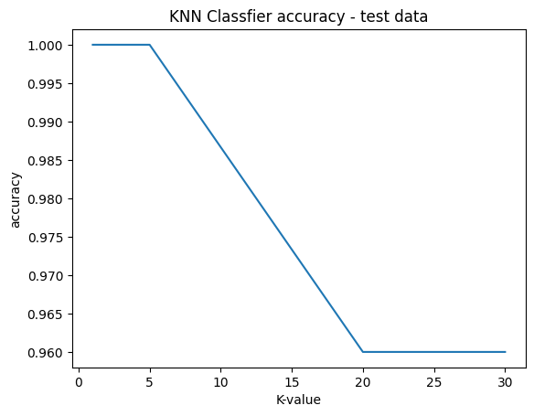

---

## 6. Implement the non-parametric Locally Weighted Regression algorithm in order to fit data points. Select appropriate data set for your experiment and draw graphs

```py
import numpy as np
import matplotlib.pyplot as plt
from scipy.stats import gaussian_kde

def locally_weighted_regression(x_train, y_train, x_test, tau):
    distances = np.array([np.abs(x_test - x) for x in x_train])
    weights = np.exp(-(distances**2)/(2*(tau**2)))
    x = np.array([np.ones_like(x_train), x_train]).T
    w = np.diag(weights)
    beta = np.linalg.inv(x.T @ w @ x) @ x.T @ w @ y_train
    y_pred = beta[0] + beta[1]*x_test
    return y_pred, beta

x_train = np.array([5, 1, 2, 1])
y_train = np.array([25, 5, 7, 8])
x_test_points = np.linspace(min(x_train), max(x_train), num=50)
tau = 0.4

lwr_y_pred = []
for x_test in x_test_points:
    y_pred,_ = locally_weighted_regression(x_train, y_train, x_test, tau)
    lwr_y_pred.append(y_pred) 

x_train_std = np.array([np.ones_like(x_train), x_train]).T
beta_std = np.linalg.inv(x_train_std.T @ x_train_std) @ x_train_std.T @ y_train
std_y_pred = lambda x: beta_std[0] + beta_std[1] * x
std_y_pred_points = std_y_pred(x_test_points)

plt.figure()
plt.title("Comparision of LWR and standard Linear Regression")
plt.scatter(x_train, y_train, color='blue', label="Training Data")
plt.plot(x_test_points, lwr_y_pred, color='red', label="LWR Predictions")
plt.plot(x_test_points, std_y_pred_points, color='green', label="Standard Linear Regression")

plt.legend()
plt.show()
```

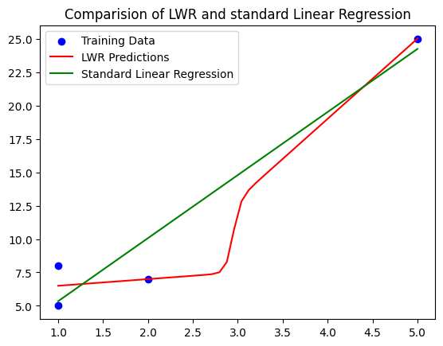

---

## 7. Develop a program to demonstrate the working of Linear Regression and Polynomial Regression. Use Boston Housing Dataset for Linear Regression and Auto MPG Dataset (for vehicle fuel efficiency prediction) for Polynomial Regression.

### Part 1: Boston Housing Dataset for Linear Regression
```py
import numpy as np
import pandas as pd
import matplotlib.pyplot as plt
from sklearn.linear_model import LinearRegression
from sklearn.preprocessing import PolynomialFeatures
from sklearn.model_selection import train_test_split
from sklearn.metrics import mean_squared_error, r2_score
from sklearn.pipeline import make_pipeline

# import warnings
# warnings.filterwarnings('ignore')

boston_df = pd.read_csv(r"BostonHousing_exp-7.csv")
x_boston = boston_df[['RM']]
y_boston = boston_df['MEDV']

x_train, x_test, y_train, y_test = train_test_split(x_boston, y_boston, test_size=0.2, random_state=32)

lr = LinearRegression()
lr.fit(x_train, y_train)
y_pred = lr.predict(x_test)

print(f"Intercept:{lr.intercept_:.2f}")
print(f"Coefficients:{lr.coef_[0]:.2f}")
print(f"R^2 score:{r2_score(y_test, y_pred):.2f}")
print(f"Mean squared error:{mean_squared_error(y_test, y_pred):.2f}")

plt.figure(figsize=(6, 4))
plt.scatter(x_test, y_test, color='blue', label='Actual')
plt.plot(x_test, y_pred, color='red', label='Predicted')
plt.xlabel('Average number of rooms [RM]')
plt.ylabel('House price (in $1000s)')
plt.title('Linear Regression on Boston Housing Data')
plt.legend()
plt.tight_layout()
plt.show()
The predicted diagnosis for the new sample is: M
```

`Intercept:-35.17`

`Coefficients:9.17`

`R^2 score:0.40`

`Mean squared error:53.87`

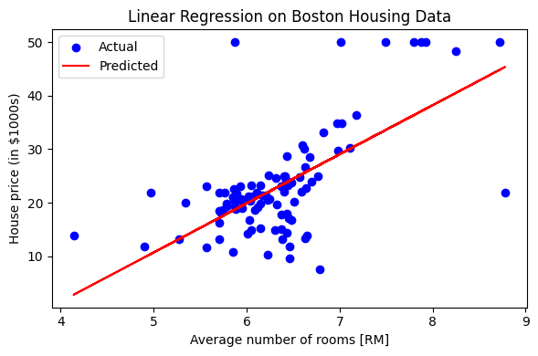

### Part 2: Polynomial Regression on Auto MPG Dataset (from hard drive)

```py
# Load Auto MPG dataset
auto_df = pd.read_csv("auto-mpg.csv")

# Clean 'horsepower' column
auto_df['horsepower'] = auto_df['horsepower'].replace('?', np.nan)     # Replace '?' with NaN
auto_df['horsepower'] = pd.to_numeric(auto_df['horsepower'])           # Convert to numeric
auto_df.dropna(subset=['horsepower', 'mpg'], inplace=True)             # Drop rows with NaNs

# Prepare features and target
X_auto = auto_df[['horsepower']]
y_auto = auto_df['mpg']

# Train-test split
X_train, X_test, y_train, y_test = train_test_split(X_auto, y_auto, test_size=0.2, random_state=2005)

# Polynomial Regression (degree 2)
degree = 2
poly_model = make_pipeline(PolynomialFeatures(degree), LinearRegression())
poly_model.fit(X_train, y_train)
y_pred_poly = poly_model.predict(X_test)

# Output
print("\n=== Polynomial Regression on Auto MPG Dataset ===")
print(f"R² Score: {r2_score(y_test, y_pred_poly):.2f}")
print(f"MSE: {mean_squared_error(y_test, y_pred_poly):.2f}")

# Plot
X_plot = np.linspace(X_auto['horsepower'].min(), X_auto['horsepower'].max(), 100).reshape(-1, 1)
y_plot = poly_model.predict(X_plot)

plt.figure(figsize=(6, 4))
plt.scatter(X_auto, y_auto, alpha=0.4, label='Actual')
plt.plot(X_plot, y_plot, color='red', linewidth=2, label=f'Degree {degree} Fit')
plt.xlabel("Horsepower")
plt.ylabel("MPG")
plt.title("Polynomial Regression: Auto MPG")
plt.legend()
plt.tight_layout()
plt.show()
```

`=== Polynomial Regression on Auto MPG Dataset ===`

`R² Score: 0.57`

`MSE: 23.79`

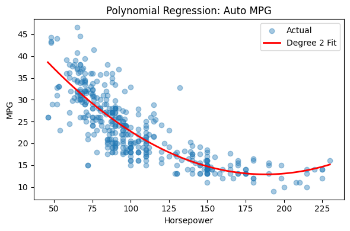

---

## 8. Develop a program to demonstrate the working of the decision tree algorithm. Use Breast Cancer Data set for building the decision tree and apply this knowledge to classify a new sample.

```py
# Import necessary libraries
import pandas as pd
from sklearn.model_selection import train_test_split
from sklearn.tree import DecisionTreeClassifier, plot_tree
import matplotlib.pyplot as plt

# Step 1: Load the dataset
data = pd.read_csv(r'WBCD.csv')

# Step 2: Clean the dataset
# Drop 'id' column and any unnamed columns if present
data = data.drop(columns=[col for col in data.columns if 'Unnamed' in col or col == 'id'])

# Step 3: Prepare features and labels
X = data.drop('diagnosis', axis=1) # Features
y = data['diagnosis'] # Target

# Step 4: Split the data into training and testing sets
X_train, X_test, y_train, y_test = train_test_split(X, y, test_size=0.2, random_state=42)

# Step 5: Build and train the Decision Tree model
clf = DecisionTreeClassifier(criterion='gini', random_state=42)
clf.fit(X_train, y_train)

# Step 6: Evaluate model accuracy
accuracy = clf.score(X_test, y_test)
print(f"Model Accuracy on Test Data: {accuracy:.2f}")

# Step 7: Visualize the Decision Tree
plt.figure(figsize=(20,10))
plot_tree(clf, feature_names=X.columns, class_names=['Benign', 'Malignant'], filled=True)
plt.show()


# Step 8: Classify a new sample
# Important: new_sample must be a DataFrame with same columns as training features
import numpy as np
# Example new sample (Replace values appropriately)
new_sample_array = np.array([[14.5, 20.5, 95.5, 640, 0.1, 0.2, 0.3, 0.15, 0.25, 0.07,
                              0.2, 0.6, 2.3, 30, 0.006, 0.05, 0.05, 0.02, 0.02, 0.004,
                              16, 30, 100, 800, 0.14, 0.35, 0.45, 0.2, 0.3, 0.08]])
new_sample_df = pd.DataFrame(new_sample_array, columns=X.columns)
prediction = clf.predict(new_sample_df)
print(f"The predicted diagnosis for the new sample is: {prediction[0]}")

```

`Model Accuracy on Test Data: 0.95`
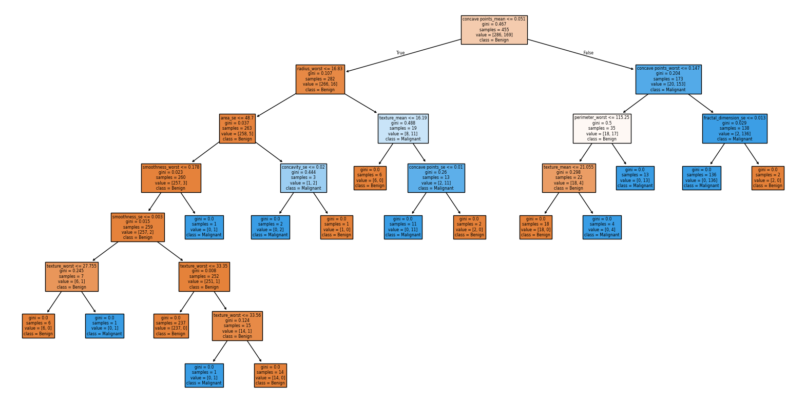
`The predicted diagnosis for the new sample is: M`

---

## 9. Develop a program to implement the Naive Bayesian classifier considering Olivetti Face Data set for training. Compute the accuracy of the classifier, considering a few test data sets.

```py
import pandas as pd
from sklearn.model_selection import train_test_split
from sklearn.naive_bayes import GaussianNB
from sklearn.metrics import accuracy_score

# Load the data from the uploaded CSV files
X = pd.read_csv(r"olivetti_x-lab9.csv", header=None)
y = pd.read_csv(r"olivetti_y-lab9a.csv", header=None)

# Flatten target variable to 1D array
y = y.values.ravel()

# Split the dataset into training and test sets (80% train, 20% test)
X_train, X_test, y_train, y_test = train_test_split(X, y, test_size=0.2, random_state=42)

# Initialize the Naive Bayes classifier (GaussianNB is suitable for continuous features)
nb_classifier = GaussianNB()

# Train the classifier
nb_classifier.fit(X_train, y_train)

# Make predictions on the test data
y_pred = nb_classifier.predict(X_test)

# Compute the accuracy
accuracy = accuracy_score(y_test, y_pred)
print(accuracy)

```

`0.8375`

---

## 10. Develop a program to implement k-means clustering using Wisconsin Breast Cancer data set and visualize the clustering result.

```py
import pandas as pd
from sklearn.preprocessing import StandardScaler
from sklearn.cluster import KMeans
from sklearn.decomposition import PCA
import matplotlib.pyplot as plst
import seaborn as sns

# Step 1: Load the dataset from local CSV file
# Replace 'WBCD.csv' with the full path if it's not in the same directory
df = pd.read_csv('WBCD-lab8.csv')

# Step 2: Drop non-numerical or irrelevant columns
X = df.drop(columns=['id', 'diagnosis'])

# Step 3: Normalize the features
scaler = StandardScaler()
X_scaled = scaler.fit_transform(X)

# Step 4: Apply KMeans clustering (assuming 2 clusters: benign and malignant)
kmeans = KMeans(n_clusters=2, random_state=42)
clusters = kmeans.fit_predict(X_scaled)

# Step 5: Reduce dimensions to 2D using PCA for visualization
pca = PCA(n_components=2)
X_pca = pca.fit_transform(X_scaled)

# Step 6: Plot the clusters
plt.figure(figsize=(10, 6))
sns.scatterplot(x=X_pca[:, 0], y=X_pca[:, 1], hue=clusters, palette='Set1')
plt.title('K-Means Clustering on Breast Cancer Dataset (PCA Projection)')
plt.xlabel('Principal Component 1')
plt.ylabel('Principal Component 2')
plt.legend(title='Cluster')
plt.grid(True)
plt.tight_layout()
plt.show()

```

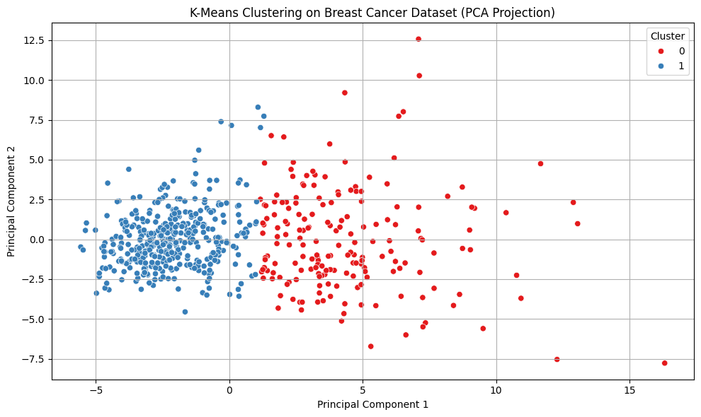

---